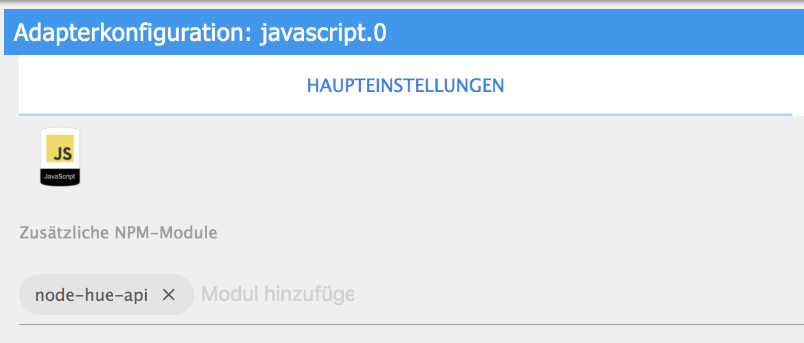
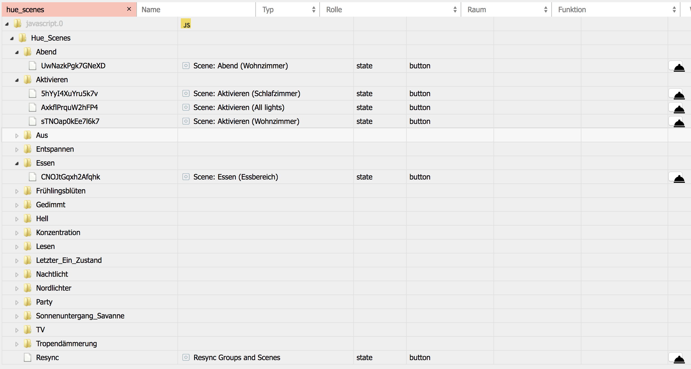

# iobroker.hue_scenes
ioBroker Javascript for activating Hue scenes

## Installation
In the ioBroker Javascript Adapter, the module "node-hue-api" has to be loaded.
In the script, host and username needs to be set (both values can be copied from ioBroker Hue Adapter)

## Screenshots

